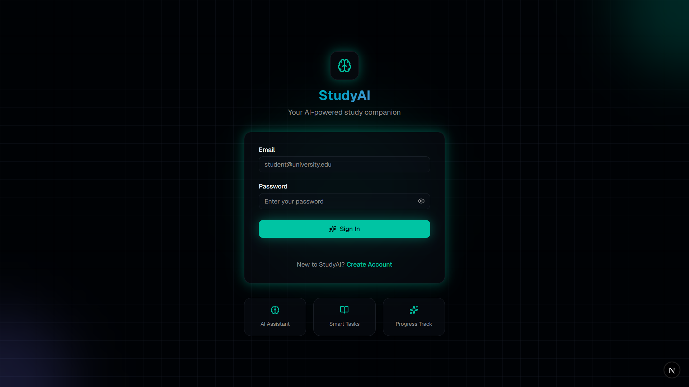
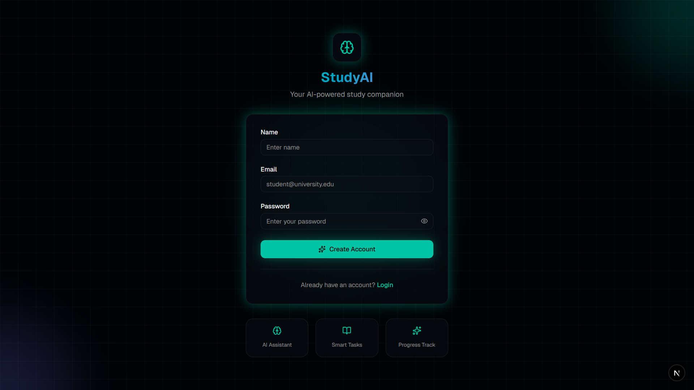
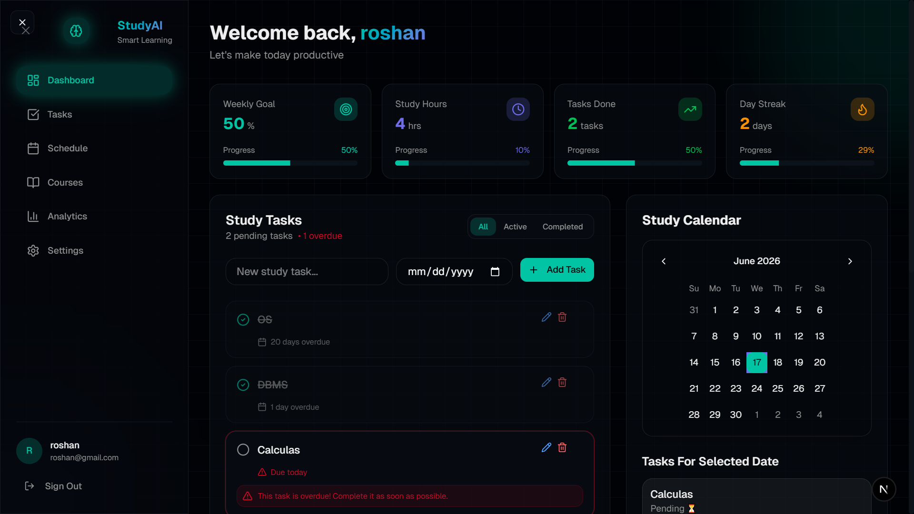
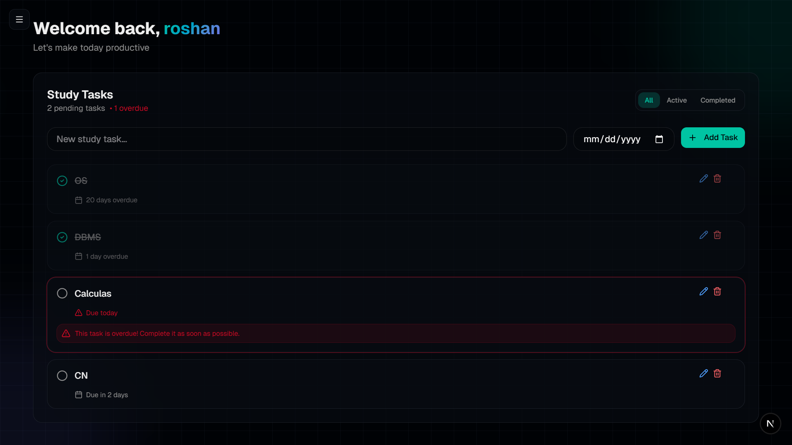
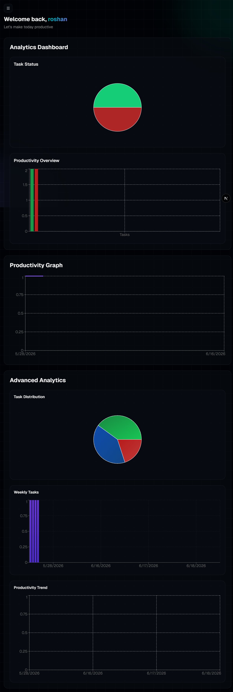

# 📚 AI Study Planner

An intelligent study management platform designed to help students organize tasks, track progress, and improve productivity with the assistance of AI.

## 🚀 Overview

AI Study Planner is a full-stack web application that combines task management, progress tracking, analytics, and AI-powered study assistance in a modern and user-friendly interface.

The platform helps students stay organized, monitor their academic progress, and receive instant study guidance through an integrated AI assistant.

---

## ✨ Features

### 🔐 User Authentication

* Secure user registration and login
* JWT-based authentication
* Protected user sessions

### 📋 Task Management

* Create, update, and manage study tasks
* Organize academic activities efficiently
* Track task completion status

### 📈 Progress Tracking

* Monitor study performance
* Visual representation of completed tasks
* Productivity insights

### 🤖 AI Study Assistant

* AI-powered academic support
* Study recommendations
* Concept explanations
* Exam preparation guidance

### 📊 Analytics Dashboard

* Productivity analytics
* Study progress visualization
* Performance tracking

### 📅 Calendar Integration

* Schedule study sessions
* Manage academic deadlines
* Improve time management

### 🎨 Modern User Interface

* Responsive design
* Clean and intuitive experience

---

## 🛠️ Tech Stack

### Frontend

* Next.js
* React.js
* TypeScript
* Tailwind CSS
* ShadCN UI

### Backend

* Node.js
* Express.js

### Database

* MongoDB

### Authentication

* JSON Web Token (JWT)

### AI Integration

* Groq API

---

## 📸 Project Screenshots

### 🔐 Login Page



### 📝 Create Account



### 📊 Dashboard



### ✅ Task Management



### 📈 Analytics



### 🤖 AI Assistant


---

## ⚙️ Installation

### Clone the Repository

```bash
git clone https://github.com/AhireRoshan84-alt/AI_Study_Planner.git
cd AI_Study_Planner
```

### Frontend Setup

```bash
npm install
npm run dev
```

### Backend Setup

```bash
cd server
npm install
npm start
```

### Environment Variables

Create a `.env` file inside the `server` folder and add:

```env
MONGO_URI=your_mongodb_connection_string
JWT_SECRET=your_jwt_secret
GROQ_API_KEY=your_groq_api_key
```

---

## 🎯 Future Enhancements

* Study streak tracking
* Pomodoro timer integration
* Real-time notifications
* AI-generated study schedules
* Performance prediction using Machine Learning
* Mobile application support

---

## 👨‍💻 Developer

**Roshan Ahire**

Computer Engineering Student passionate about:

* Full Stack Development
* Artificial Intelligence
* Machine Learning
* Problem Solving

---

## ⭐ Support

If you found this project useful, consider giving it a star on GitHub.

It helps motivate future improvements and supports the project.
